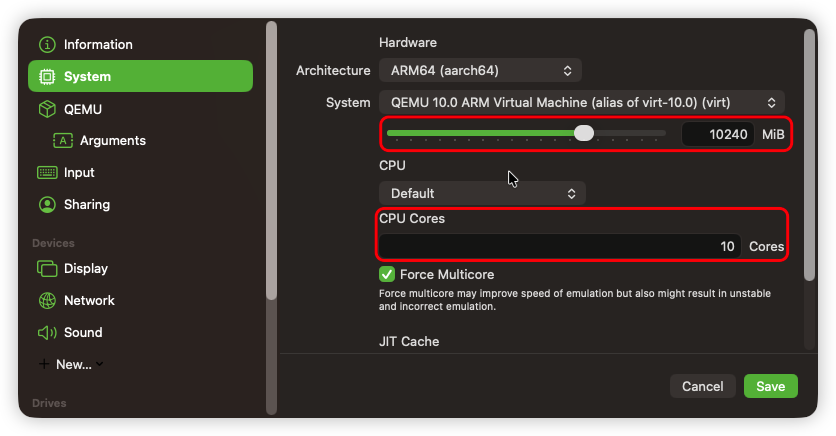
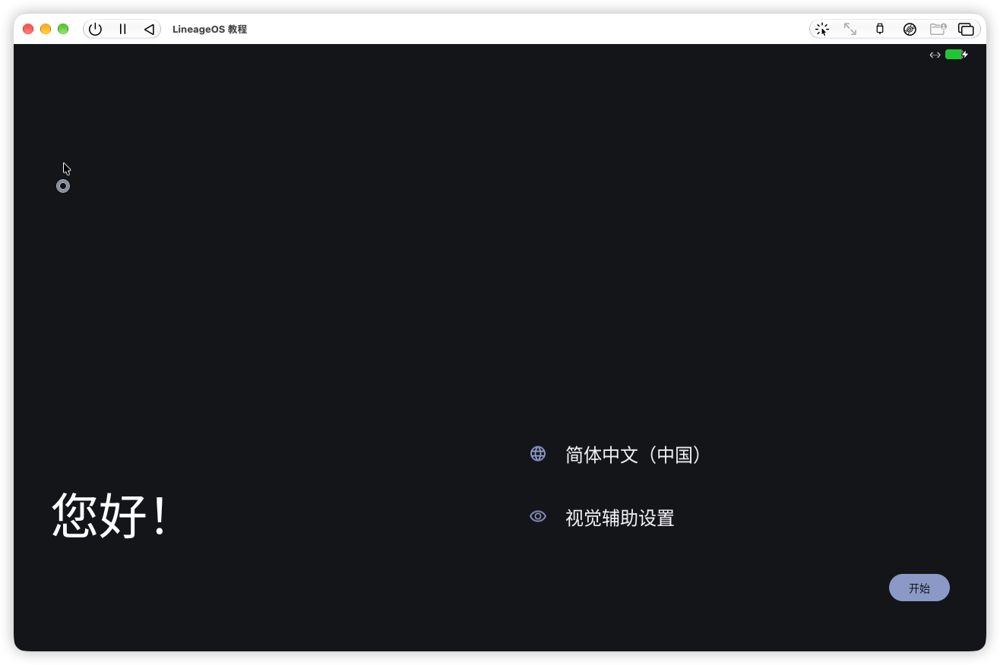

# 准备工作

1. 一台 Mac
2. 一个终端（macOS 自带即可）
3. `android-platform-tools` 包（建议用 `brew install android-platform-tools --cask` 装)
4. [UTM 虚拟机 `UTM.dmg`](https://github.com/utmapp/UTM/releases/latest/download/UTM.dmg)
5. [主虚拟机文件 `UTM-VM-lineage-xx.x-yyyymmdd-jqssun-virtio_arm64only.zip(仅 arm64 架构 - Apple Sillicon 用户)`/`UTM-VM-lineage-xx.x-yyyymmdd-jqssun-virtio_x86_64.zip(仅 x86_64 架构 - Intel Chip 用户)`](https://github.com/jqssun/android-lineage-qemu/releases/latest)
6. [[可选] GApps Add-on `MindTheGapps-xx.x.x-arm64-yyyymmdd_xxxxxx.zip`](https://github.com/MindTheGapps/16.0.0-arm64/releases/latest)
7. [[可选] `recovery_arm64only-userdebug.img(仅 arm64 架构 - Apple Sillicon 用户)`](https://github.com/jqssun/android-lineage-qemu/releases/latest/download/recovery_arm64only-userdebug.img)/[[可选] `recovery_x86_64-userdebug.img(仅 x86_64 架构 - Intel Chip 用户)`](https://github.com/jqssun/android-lineage-qemu/releases/latest/download/recovery_x86_64-userdebug.img) （可刷入未经验证的包（用于刷入 GApps） 的 Recovery)
8. [[可选] `boot_arm64only.img(仅 arm64 架构 - Apple Sillicon 用户)`](https://github.com/jqssun/android-lineage-qemu/releases/latest/download/boot_arm64only.img)/[[可选] `boot_x86_64.img(仅 x86_64 架构 - Intel Chip 用户)`](https://github.com/jqssun/android-lineage-qemu/releases/latest/download/boot_x86_64.img)（Root 用）

> [!CAUTION]
>
> GApps 仅有 `arm64` 架构 **如果你是 Intel Chip 用户 不要想了 没有你们对应架构的 GApps** 如果安装了不对应架构的 GApps 系统将会 `bootloop`
>
> `Recovery` 和 `boot.img(Kernel)` **有架构区分 刷之前务必仔细核对** 否则会出事

4. [[可选] KernelSU（Root 管理器） `KernelSU_vx.x.x_xxxxx-release.apk`](https://github.com/tiann/KernelSU/releases/latest)

# 设置虚拟机

1. 打开下载的 `.utm` 包
2. LineageOS 虚拟机设置 - Network - Network Mode - 选择 Shared Nework


3. 虚拟机默认的 `32GiB` 内部存储肯定不够用 在第一次开机前建议更改虚拟机内部存储大小 不然后期想要调整需要恢复出厂设置
> [!CAUTION]
>
> 分配前注意看磁盘名称 **一定一定要 Resize `vdb-2.qcow2` 这个虚拟磁盘文件** 这是 `userdata` 分区的盘
>
> 另一个 `vda-2.qcow2` 是 `system` 分区 **随意调整此分区大小可能会导致不可预知的问题**
>
> > [!NOTE]
> > Android 16 最大支持 `16TiB` 的磁盘 再高会 bootloop 但是不建议分配 `16TiB` 会导致 QEMU 模拟不正确 有概率导致虚拟机卡死


4. 接着来调整虚拟机内存大小和 CPU 核心数量

> [!NOTE]
>
> CPU 核心数量建议根据自己电脑的配置拉满 RAM 大小则建议 ≥ `6GiB` QEMU 不会直接吃掉你分配的所有的 CPU 核心和内存 它会根据虚拟机占用动态调整
>
> **`Force Multicore` 功能可选择性开启（就我感觉 开不开其实差不多）**



5. 先别急着进系统 进入 `Bootloader` 以后先进入设置 进行一些设置 以方便联网调试和 root

> [!NOTE]
>
> `Bootloader` 里面的每项设置功能简介
>
> > **`A/B boot control`**
> >
> > A/B 分区功能开关 此设置完全**无法使用** 因为此虚拟机完全不支持 A/B 分区😅
>
> > **`Boot animation`**
> >
> > 开机动画 默认开启 **自选是否打开**
>
> > **`Dispiay resolution`**
> >
> > 调整显示分辨率 **系统内无法调这个 建议先默认 后面折腾好了再改 不然不方便切换窗口**
>
> > **`HWUI renderer`**
> >
> > `SystemUI` 渲染器 **不建议调** 可能会导致 `SystemUI` 黑屏
>
> > **`Insecure ADB`**
> >
> > 是否允许不安全的 `ADB` 调试 也就是是否允许开放在 `5555` 端口的 `adb` 无线调试 **必开** 不然无法连接到 `adb` 调试
>
> > `Low performance optimizations`
> >
> > 低性能优化 默认关闭 如果你的 Mac 是 Apple Sillicon 则保持默认 不用开 如果是 Intel 芯片用户则视情况开 **大部分情况下你不需要开这个 保持默认即可** 
>
> > **`Mitigations`**
> >
> > **保持默认即可**
>
> > **`Quiet boot`**
> >
> > 安静启动 即在启动时不显示内核日志 默认关闭 **自选是否开启** 开启后系统开机将不显示内核日志
>
> > **`Screen density`**
> >
> > 调整系统 `DPI` 也是系统内无法调的选项 **这个也需要根据你 Mac 的屏幕分辨率 问 AI 选什么 `DPI` 合适 如果是 `1080P` 屏幕 那么默认即可**
>
> > **`Serial console function`**
> >
> > 开启或关闭虚拟机的串口控制台功能 **如果没有特殊的安卓开发需求 保持默认即可**
>
> > **`SELinux`**
> >
> > 设置 SELinux 状态 默认 `Enforcing（强制模式）` **如果你要 root 的话（特别是用 `KernelSU` root 的话） 必须改成 `Permissive（宽容模式）` 否则打开开发者模式设置会闪退**
>
> > **`Wi-Fi implementation`**
> >
> > 是否打开虚拟 Wi-Fi 功能 默认关闭 **必须选择 `VirtWifi using eth0 interface` 否则无法打开无线调试 无法 `adb`**
> >
> > 
>
> > **`ZRAM`**
> >
> > 虚拟内存功能 默认关闭 **建议打开**
>
> > **`GRUB: timeout`**
> >
> > `GRUB` 超时时间 `GRUB` 是引导器（`bootloader`） 也就是现在在的这个界面 这里调整 GRUB 超时时间 默认 3s 超时后自动进入系统 按上下键可中断倒计时 **根据需要自己调**
>
> > **`Show current setting`**
> >
> > 显示当前选择的选项

[grid]


[/grid]

6. 如果你调过 `userdata` 分区大小的话 退出到主界面 选择 `Recovery` 并且进入

   接下来选择 `Factory reset` - `Format data/factory reset`

   选择 `Format data` 并且等待 等待时长由你磁盘大小决定

   > [!CAUTION]
   >
   > :spoiler[~~*虽然虚拟机里大概率没有重要数据*~~] 但是还是提醒一下 **这一步会清空你虚拟机里面的所有数据 有重要数据千万千万记得备份**

   > [!TIP]
   >
   > `ERROR: recovery: Failed to save locale to /cache/recovery/last_locale: No such file or directory` 若 Rocovery 里报错这些是正常的 是因为没有初始化系统导致的
   
   当 UI 再次出现 下方显示 `Data wipe complete.` 就可以了
   
   正常完成后应该输出：
   
   ```Recovery
   -- Wiping data...
   Formatting /data...
   Formatting /cache...
   Formatting /metadata....
   Resetting memtag message...
   Data wipe complete.
   ```
   
   

[grid]


[/grid]

7. [可选] 安装 Google Apps

   > [!CAUTION]
   >
   > GApps 必须在第一次启动系统之前安装 否则会 `bootloop` 所以第一次启动系统前千万要斟酌一下 确保不会用到 GApps 再启动 不然后期再想装只能恢复出厂设置再安装
   >
   > > [!NOTE]
   > >
   > > 因为虚拟机自带的 `Recovery` 有强制包签名校验 导致刷入开源没有签名的 GApps Add-on 会报错
   > >
   > > ```Recovery
   > > ERROR: Recovery: Faiied to verffy whole-file signature.
   > > Update package verification took 10.6 s （result 1）.
   > > ERROR: recovery: Signature verification failed.
   > > ERROR: recovery: Err： 21
   > > ```
   > >
   > > 所以要刷入带 `userdebug` 标签的允许刷入未经签名的包的 `Recovery`

- 进入 `Recovery` 首页 - `Advanced` - `Enter fastboot` 进入 `fastbootd` 并记下上面的 `IPv4 address - 192.168.xx.x`

- 进入到 `Fastbootd` 首页 记下上面的 `IPv4 address - 192.168.xx.x`

- 接着打开终端

  ```fish
   fastboot -s tcp:$HOST_IP flash recovery /path/to/recovery_arm64only-userdebug.img    # 把 $HOST_IP 替换成 Fastboot 里面给你的 IP /path/to/recovery_arm64only-userdebug.img 替换成你下载的 Recovery 镜像的位置
  ```

  - 输出应该类似这样：

  ```fish
  Sending 'vendor_boot' (59492 KB)                   OKAY [  0.132s]
  Writing 'vendor_boot'                              OKAY [  0.068s]
  Finished. Total time: 0.251s
  ```

- `Fastbootd` 里选择 `Power off` 关机 重启再启动到 `Recovery` - `Apply update` - `Apply from ADB` - 再次记下上面的 `IPv4 address - 192.168.xx.x

  > [!TIP]
  >
  > ```Recovery
  > ERROR: recovery： [libfs_mgr］ Failed to mount /mnt/vendor/shared: Invalid argument
  > ERROR: recovery： [libfs_mgr］ Failed to mount /mnt/vendor/shared: No such file or directory
  > ERROR: recovery： [libfs_mgr］ Failed to mount for path ［/mnt/vendor/shared］
  > ```
  >
  > 若 Rocovery 里报错这些也是正常的 还是因为没有初始化系统导致的

- 底下显示 `Now send the package you want to apply to the device with "adb sideload <filename>"...` 时打开终端

  ``` fish
   adb connect $HOST_IP    # 把 $HOST_IP 替换成 Recovery 里面给你的 IP
  ```

  - 输出应该类似这样：

  ```fish
  * daemon not running; starting now at tcp:5037
  * daemon started successfully
  connected to 192.168.64.3:5555
  ```

  - 接下来用 `adb devices` 检查是否连接上：

  ```fish
   adb devices
  List of devices attached
  192.168.xx.x:5555       recovery
  ```

  - 显示如上则已连接上

  - 接下来开始侧载：

  ```fish
  adb sideload -h /path/to/MindTheGapps-xx.x.x-arm64-yyyymmdd_xxxxxx.zip    # 把 /path/to/MindTheGapps-xx.x.x-arm64-yyyymmdd_xxxxxx.zip 替换成你下载的 GApps 包的位置
  ```

  - `Recovery` 里会提示
  
  ```Recovery 
  Signature verification failed
  Install anyway?
  ```
  
  -  选 `Yes` 
  
  > [!TIP]
  >
  > 应当会输出
  >
  > ```Recovery
  > ERROR: recovery: Failed to find CPU thermal info in /sys/class/thermal/
  > ```
  > 报错这个这是正常的 因为虚拟机的缘故
  > 
  > ```Recovery
  > Supported API:3
  > Finding update package.
  > Verifying update package.
  > ```
  > 
  > ```Recovery
  > ERROR: recovery: failed to verify whole-file signature
  > Update package verification took 10.6 s （result 1）・
  > ERROR: recovery: Signature verification failed
  > ERROR: recovery: error: 21
  > ```
  > 
  > 报错这个也是正常的 因为开源 GApps 没有包签名 只要在 `Recovery` 里提示
  >
  > ```Recovery 
  > Signature verification failed
  > Install anyway?
  > ```
  >
  > 的时候选 `Yes` 即可继续 
  > 
  > ```Recovery
  > Installing update.
  > **********************
  > MindTheGapps installer
  > **********************
  > ```
  > 
  > 正式开始安装

- 当 UI 再次出现 `Recovery` 日志提示
  
  ```   Recovery
  Cleaning up files
  Unmounting partitions
  Done!
  
  Install completed with status 0.
  ```

  即已完成

  选择 `Reboot system now` 进入系统


# 系统设置和 Root

1. `bootloader` 里选择第一项 `LineageOS xx.x` 进系统
2. 第一次启动系统可能会比较慢 特别是你选择了装 GApps 的时候 具体时长与电脑性能有关


3. 简单过下 `OOBE`

   > [!TIP]
   >
   >  带 GApps 的版本和不带的 OOBE 略有区别
   >
   > 这是无 GApps 的版本：
   >
   > 



4. 先连下 WiFi 再进`设置` - `关于本机` - 狂点最下面的 `Build 号` 进入开发者模式

5. `设置` - `系统` - `开发者选项` - `无线调试` - `允许`


4. 进入 `无线调试` 记下里面的 IP


5. 打开终端

